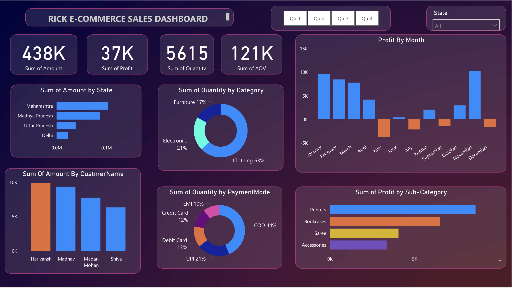

# PowerBI-Project
This Power BI project showcases a comprehensive E-Commerce Sales Dashboard built to track and analyze business performance across various dimensions like state, customer, category, and payment methods. The dashboard helps uncover insights on sales volume, profitability, and purchasing behavior—empowering data-driven decision-making.

# Dashboard

# 📊 Key Highlights
💰 Total Sales: ₹438K

📈 Total Profit: ₹37K

📦 Total Quantity Sold: 5615 units

📊 Average Order Value (AOV): ₹121K

# 📍 Visual Breakdown
Bar Chart: Sum of Amount by State (e.g., Maharashtra, MP, UP)

Donut Charts:

Quantity by Category (Clothing, Electronics, Furniture)

Quantity by Payment Mode (COD, UPI, Debit/Credit Card, EMI)

Monthly Profit Analysis: Bar chart showing monthly profit/loss trends

Customer Contribution: Top customers based on total sales

Sub-Category Insights: Profitability by item sub-categories

# 🧩 Filters and Interactivity
📅 Quarter Selection: Q1, Q2, Q3, Q4 toggles for period-based filtering

🌍 State Filter: Dropdown to view regional performance

🔄 Fully interactive visuals for seamless exploration and analysis

# 🧰 Tools Used
Power BI Desktop

DAX for calculated fields and KPIs

Power Query for data transformation and cleaning

Custom Themes for a visually appealing layout

# 👥 Target Audience
This dashboard is ideal for:

E-commerce business owners

Sales managers

Business analysts

Marketing teams

# 🚀 How to Use
	1.	Clone or download this repository.
	2.	Open the .pbix file with Power BI Desktop.

## 👤 Author
**Sayan Nandi** 
